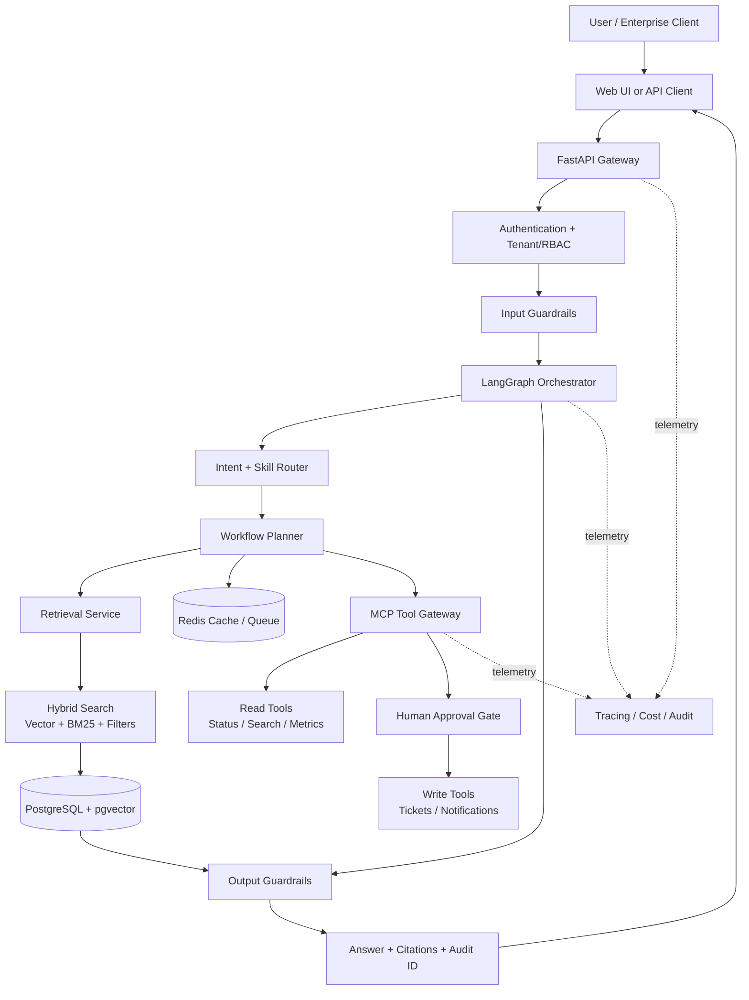
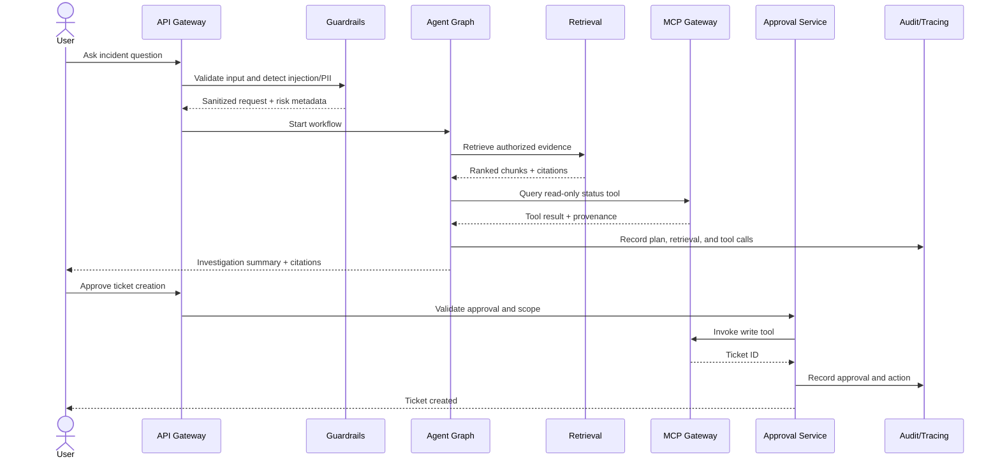
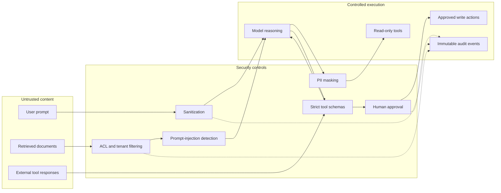
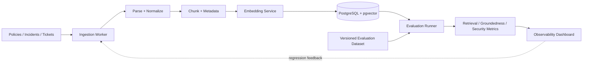

# Enterprise Agentic Operations Platform

## 1. Platform architecture

## 2. Incident-response request lifecycle

## 3. Trust boundaries

## 4. Knowledge and evaluation loop

## 5. Interview narrative

The platform is intentionally demonstrated through one complete workflow:

1. A user asks about an incident.
2. The system authenticates the user and applies tenant/RBAC filters.
3. The agent retrieves and cites relevant evidence.
4. A read-only MCP tool checks current system status.
5. Guardrails validate the answer and detect unsupported claims.
6. The user approves a ticket action.
7. The write tool runs with a constrained schema.
8. Every retrieval, tool call, approval, cost, and result is auditable.

The architecture can later support customer support, market research, HR, and finance workflows by adding skills and MCP servers without changing the platform security and evaluation layers.
